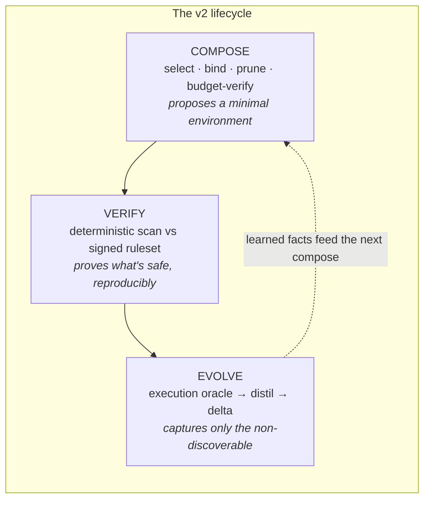
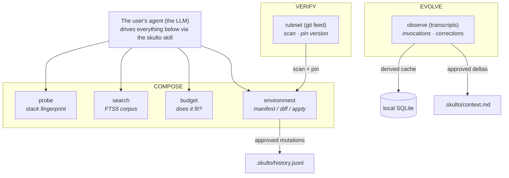
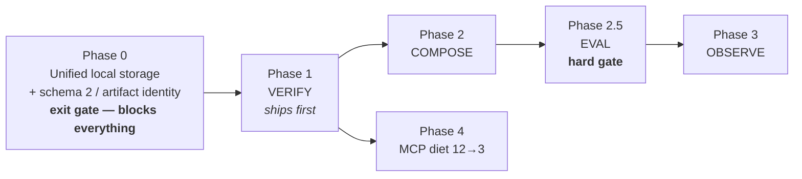

## Start here: the one-sentence pivot

Skulto v1 is a package manager for AI-agent skills. It scrapes them from GitHub, indexes
them in SQLite, scans them for prompt injection, and symlinks them into 33 AI coding tools.
**The unit of management is a single skill** — you find one, you install one.

Skulto v2 changes the unit of management to **the environment**: the *whole set* of skills a
repository runs on, taken together and held to a standard.

That sounds like a small reframe. It is actually the entire bet, and it flips the product's
value proposition upside down:

:::callout tip
**Headline value is subtraction, not addition.** v1 helps you *add* the right skill. v2's
core promise is to give you *fewer, provably-safe, provably-fitting* skills — and to prove
the remainder is auditable and observed. The market is drowning in artifacts; v2 sells the
bucket, not more water.
:::

Before we justify that bet, let's make sure the pivot itself is clear.

:::quiz
What is the "unit of management" in skulto v2?
- ( ) A single skill you search for and install
- (x) The complete set of skills a repository runs on, taken as a whole
- ( ) A GitHub repository of skills
- ( ) An AI coding tool (Claude, Codex, etc.)
> v1 manages one skill at a time. v2 manages the *environment* — the whole budgeted, audited,
> observed set — which is what lets it make claims about fit, safety, and what actually fires.
:::

By the end of this walkthrough you'll be able to explain why this pivot is defensible, how
the three capabilities (Compose, Verify, Evolve) fit together, what keeps the system honest
(the invariants and the security model), and — most importantly — the single experiment that
is allowed to kill the flagship feature before we ever ship a claim about it.

---

## Why now: the market is complaining about *too much*, not too little

Every product decision in v2 traces back to a table of practitioner pain, ranked by how
strong the evidence is. This is worth internalizing, because it's what makes the pivot
*evidence-led* rather than a hunch.

| Pain | Evidence | Independent sources |
|---|---|---|
| Context bloat; people actively **deleting** MCP servers and skills | **STRONG** | 10+ |
| Skills silently truncated → never fire | **STRONG** | 8+ |
| Trust: 36% of published skills contain injection flaws | **STRONG** | 6+ |
| Agent ignores CLAUDE.md / repo conventions | **STRONG** | 5+ |
| *Generic skills need forking for my stack* | **WEAK — contradicted** | ~1 |
| *Authoring a skill is hard* | **WEAK — contradicted** | — |

Look at the shape of that table. The **strong** pains are all about having *too much* and
*trusting none of it*. The **weak, contradicted** ones are the "help me make/customize more
skills" ideas — the intuitive product directions that the evidence actively argues against.

The hard numbers behind the top rows are the part to remember in a pitch:

- **7 MCP servers ≈ 67,300 tokens ≈ 33.7%** of a 200k window — spent *before the user types
  anything*.
- Tool-selection accuracy fell **95% → 71%** with a single large MCP server loaded.
- Claude Code injects skill descriptions under a **~15,000-char budget**. Exceed it and skills
  stay installed but become **invisible** — silently. One reported issue shows *"Showing 60 of
  3218 skills"* when only 169 existed.
- Passive skill trigger rate from descriptions alone: **30–50%**. Half your skills may never
  fire.
- Snyk's "ToxicSkills" audit of 3,984 skills: **36% contain injection or security flaws,
  13.4% critical, 76 confirmed malicious payloads, 8 still live at publication.**

:::callout warning
The strategic read: **a product that adds artifacts is fighting the current.** A product that
*removes* them, makes the remainder reproducibly auditable, and reports what actually ran is
riding it. Every headline claim in v2 maps back to a STRONG row above.
:::

:::reveal Before reading on — given this evidence, which capability should skulto ship *first*: the exciting "compose my environment" feature, or the "audit my supply chain" feature?
**Verify (audit) ships first.** It attacks the #3 STRONG pain, it's half-built already, it
depends on nothing else, and it's the *credibility wedge*: "the skill manager that audits your
supply chain" earns the right to later say "…and here's how it composes your environment." The
reverse order asks strangers to trust an unevidenced thesis. (We'll return to this in Phasing.)
:::

### The competitive gap is real — and empty *for a reason*

No shipped product specializes a curated skill for a specific project. The near-misses all
stop short: Vercel's `skills` (25,947★) never touches skill *content*; SkillKit `recommend`
ranks skills and stops at ranking; Cursor, Kiro, Agent OS, and BMAD all *generate* guidance
**from the codebase** or **from installed modules** — never from *what you are about to build*.

So there's a clean, empty market slot. But here's the discipline the PRD insists on:

:::callout note
**The demand research found zero organic requests for project-specific skill composition, and
zero willingness to pay.** People don't fork generic skills — *they delete them*. An empty
market slot with **no demand signal** is evidence *against* the idea, not for it. v2 treats
"compose from the spec" as an **unproven hypothesis**, not as the product.
:::

That single sentence is why the whole design is structured to lead with Verify and to gate
Compose behind a real experiment. Hold onto it.

---

## The experiment that already ran (and what it actually proved)

This is the intellectual spine of the entire design. If you remember one external result from
this walkthrough, remember this one.

**"Evaluating AGENTS.md: Are Repository-Level Context Files Helpful for Coding Agents?"** (ETH
Zurich SRI Lab + LogicStar, Feb 2026). 138 tasks from 12 real repos mined from 5,694 PRs, plus
SWE-bench Lite, across four agents.

What they found:

- **LLM-generated context files *reduced* task success** (~-2%), worse in **5 of 8 settings**.
- **Cost rose regardless: +20–23% inference cost**, +2.45–3.92 steps per task.
- Human-written context files helped, but only **+4pp**.
- **The ablation is the real finding:** delete the repo's *other* documentation first, *then*
  generate a context file, and the generated file **improves 2.7%** and beats the human one.

Sit with that ablation for a second — it explains the mechanism:

:::callout info
**Generated context is a lossy re-encoding of documentation the agent could read itself.** Its
value is *negative* when the source already exists, and *positive only when it doesn't*. That's
why the generated file only wins *after* you delete the real docs.
:::

The corollary is skulto v2's central discipline, and it governs every artifact the product is
allowed to write:

> **The only content worth writing down is content the agent cannot discover for itself.**

The human-written files earned their +4pp on exactly this class of fact — things no `grep` or
`tree` will ever reveal: *"run tests with `--no-cache` or fixtures fail"*, *"use `uv` not
`pip`"*, *"this deprecated module is load-bearing."*

:::quiz
Per the ETH result, when does an LLM-generated context file actually *help* task success?
- ( ) Always — more context is always better
- ( ) Never — generated context is always harmful
- (x) Only when the repository's other documentation has been removed first
- ( ) Only for repositories larger than SWE-bench Lite
> The ablation is the finding: generated context only beats the baseline once the real docs
> it was re-encoding are deleted. When the source exists, the re-encoding is net-negative. This
> is *why* v2 refuses to generate prose and writes down only the non-discoverable.
:::

### The discoverability test, applied to skulto's own repo

The PRD runs its own `AGENTS.md` through this test as a live demo. **Discoverable** content
(net-negative by the ETH criterion — the agent reads it in a tool call or two): the Quick Facts
table (it's all in `go.mod`/`Makefile`), the Repository Tour (that's `tree`), Build/Run/Test
commands (a paraphrase of the Makefile), "follow standard Go conventions."

**Non-discoverable** content (the +4pp class — no linter catches these, no generic skill
contains them):

1. **"Three interfaces, one codebase."** Every feature must land in CLI *and* TUI *and* MCP.
   The compiler will never tell you that you shipped a CLI command with no MCP handler.
2. **The telemetry four-step ritual.** Steps 1–3 are compiler-enforced; **step 4 is not**, and
   it's the one that silently breaks the product.
3. **`make dev`/`make test-race` need `CGO_ENABLED=1`**, even though the DB layer was chosen
   pure-Go to *avoid* CGO — so an agent hits a confusing race-detector failure it can't explain.
4. **"Every symlink points under `~/.agents/skulto/`"** — an invariant Go's type system can't
   express.

:::callout tip
**Roughly 85% of skulto's own `AGENTS.md` is content the paper says costs you success rate.**
That ratio *is* the product demo. The remaining 15% is precisely the material Compose is
allowed to help capture — and only via human-approved deltas.
:::

---

## The three capabilities: Compose, Verify, Evolve

With the "why" established, here is the "what." v2 is three capabilities arranged as a
lifecycle. Read the middle column as the *promise* and the right column as the *mechanism*.

| Capability | Promise | Mechanism |
|---|---|---|
| **Compose** | Propose a minimal, budgeted environment *intended to be sufficient* for the work at hand | select → bind → prune → budget-verify |
| **Verify** | Produce *reproducible* results against a *named* security ruleset, and keep them current | deterministic scan → signed, patchable rule feed |
| **Evolve** | Feed back what the agent learned by running — and *only* what it couldn't have read | execution oracle → distil → delta-update |

Two words in that table are doing careful, deliberate work, and technical co-founders should be
precise about them:

- **"minimal"** is the *composition objective*, not a proof of global minimality.
- **"intended to be sufficient"** is an *agent proposal*, not a Skulto guarantee.

:::callout warning
This hedging is not timidity — it's the product's integrity model. Skulto makes **deterministic**
claims (budget arithmetic, digests, scan verdicts) and refuses to dress up **probabilistic** agent
proposals as guarantees. The moment it blurs that line, it becomes the thing it's replacing.
:::



:::quiz
Which of these is a claim skulto is willing to make *as a guarantee*?
- ( ) "This is the globally minimal set of skills for your task"
- ( ) "This environment is sufficient to complete the work"
- (x) "This environment's budget cost is exactly N tokens, and every skill's content hashes to this digest"
- ( ) "This skill will definitely fire when relevant"
> Skulto guarantees only what is deterministic: arithmetic, digests, and rule-driven scan
> verdicts. Minimality and sufficiency are *objectives and proposals* — labeled as such
> everywhere they appear.
:::

---

## The architectural spine: skulto ships tools, the agent supplies intelligence

Here's the single most important architecture decision, and it's counterintuitive.

Compose *needs* an LLM — to turn a PRD into search queries, to run the discoverability test,
to classify a correction. And the repo already contains `internal/llm/`: a fully-built client
(Anthropic/OpenAI/OpenRouter, streaming, tests). It is **completely unimported.**

The v2 decision: **leave it dead — delete it.**

:::reveal Why would you delete a working, fully-tested LLM client instead of wiring it in? Think about who pays, what breaks determinism, and where the user already is.
Deleting it buys four things:
1. **No new skulto-managed model credential.** Deterministic search, pinning, audit, and budget
   arithmetic stay offline-capable.
2. **No skulto-operated inference bill.** Agent-CLI usage is visible to and paid by the user under
   *their own* account.
3. **The interview happens where the user already lives** — conversationally, with the repo loaded.
4. **No agent assertion becomes a skulto guarantee.** Proposals can be wrong; budget, digest,
   ruleset, and apply results are deterministic and independently validated.
:::

So the spine is: **skulto exposes deterministic primitives and orchestrates the user's own,
locally-installed agent CLI when intelligence is needed.** The agent *proposes*; skulto
*probes, counts, scans, searches, validates, records approval, and writes.*



There are **two bodies of the same one skill**, branching by environment. In a coding agent
with a shell, it runs `skulto compose prepare --json` and the read-only analysis commands. In
Claude/Codex *Desktop* (no repo, no shell), it falls back to three MCP tools. Crucially:

:::callout tip
**You never pay for both.** In a coding agent: CLI + one skill ≈ **120 tokens**, MCP not
connected. In Desktop: MCP + the same skill ≈ **420 tokens**, and nothing else competes for
that budget. Connecting both is a misconfiguration — and `skulto doctor` says so out loud.
:::

### Capability-gated, not parity-gated

This supersedes the old ADR that demanded all three interfaces (CLI/TUI/MCP) be at parity.
Desktop clients have no project cwd, no repo shell, no transcripts — they *cannot* compose,
audit, or observe. So the surfaces are gated by *capability*, not held to feature parity.

The MCP server drops from **12 tools to 3**: `skulto_search`, `skulto_get_skill`,
`skulto_install` — about **300 tokens, down from ~1,200.** The membership rule (destined for
the ADR) is worth quoting:

> A tool earns permanent MCP residency only if **(1)** the environment cannot reach the CLI,
> **and (2)** the need arises spontaneously mid-conversation.

Search passes both. `skulto_get_stats` passes neither — and never did.

:::quiz
Why is `internal/llm/` deleted rather than wired into Compose?
- ( ) It has bugs that would take too long to fix
- ( ) It only supports OpenAI, not Anthropic
- (x) Orchestrating the user's own agent CLI avoids a new credential/bill, keeps skulto deterministic, and puts the interview where the user already works
- ( ) MCP tools already provide LLM access
> The spine of v2 is "skulto ships deterministic tools; the user's agent supplies the
> intelligence." An embedded LLM client would add a credential, a bill, and — worst — the
> temptation to let an agent assertion masquerade as a skulto guarantee.
:::

---

## What keeps it honest: the invariants

There are 17 invariants in the PRD. They are called "the constitution" — *violating one is a
bug, not a trade-off.* You don't need all 17 memorized, but a technical co-founder should be
able to name the load-bearing ones and say why each exists.

:::callout info
The invariants exist because every one of them, if violated, turns skulto into either (a) the
bloat it's curing, (b) a tool that silently corrupts the user's files, or (c) a "trust product"
that leaked trust. They're the guardrails around the product's entire reason to exist.
:::

The ones to know:

- **#1 — Skulto never authors a capability claim.** It selects, binds, prunes, orchestrates.
  Generation is confined to non-discoverable facts *elicited from a human* or *extracted from a
  verified execution trace* — never invented from reading a repo. (This is the ETH result, made
  into law.)
- **#2 — Skulto never writes a file it does not own.** Two narrow, opt-in, additive, idempotent
  exceptions: one delimited reference line in `AGENTS.md` pointing at `.skulto/context.md`, and a
  minimal set of *read-only* command patterns appended to the Bash allowlist. Nothing else. Ever.
- **#3 — `.skulto/context.md` changes by entry-level delta only, never whole-file regeneration.**
  (See the ACE "context collapse" result below — this one has teeth.)
- **#5 — Every write passes a human approval gate.** Skulto proposes; the human disposes.
- **#7 — Skulto's own always-on context footprint is a published, enforced budget (~120 tokens).**
  `skulto doctor` *fails* if it grows. (The product cannot become the disease.)
- **#8 — Transcript content never leaves the machine.** No transcript text, no correction span,
  no file path, no skill body, no search query in any telemetry event. Enforced by test.
- **#9 — Flag, never delete or disable automatically.** A skill that newly fails audit stays
  active but is marked; new install/upgrade is blocked until it's fixed or explicitly accepted.

:::callout warning
**The ACE "context collapse" result** is why invariant #3 is absolute. In ACE, a single wholesale
regeneration took an accumulated context from **18,282 tokens @ 66.7% accuracy** down to **122
tokens @ 57.1%** — *below the no-adaptation baseline of 63.7%.* One bad rewrite erased everything.
The lesson: **delta updates, never rewrites.**
:::

:::reveal Invariant #9 says a newly-failing skill is *flagged, not disabled*. Why not just auto-disable something that fails a security scan — isn't that safer?
Auto-disabling is a *destructive, automatic* action on the user's working environment, taken on
the say-so of a ruleset that itself changes over time. A new rule landing shouldn't silently break
someone's working setup mid-task. So skulto **flags and reports**, blocks *new* installs/upgrades
of the failing content, and requires a human to fix it or explicitly accept the exact findings for
the exact content digest. Safety *and* the human-approval invariant, both preserved.
:::

:::quiz
`.skulto/context.md` must be updated by entry-level delta only. What real-world result makes whole-file regeneration forbidden?
- ( ) It's slower to regenerate the whole file
- (x) ACE's "context collapse" — one wholesale rewrite dropped accuracy below the no-adaptation baseline
- ( ) Git can't diff a fully-rewritten file
- ( ) The file would exceed the token budget
> ACE showed a single regeneration collapsing 18,282 tokens @ 66.7% to 122 tokens @ 57.1%,
> below the 63.7% baseline. Delta-only updates make that failure mode structurally impossible.
:::

---

## Verify in depth: turning trust into something reproducible

Verify is the capability that ships first, so it deserves the closest look. Its job: **produce
a scan result that anyone can reproduce, against a specifically-identified, signed ruleset — and
re-run it as new detection rules land.**

Three design moves make that real.

**1. Rules become data, not code.** Today the scanner's rules are regex compiled into the binary
with "context-mitigation scoring that is effectively unfalsifiable." In v2 a rule is a YAML record:

```yaml
version: 2026-07-01
rules:
  - id: SKL-0012
    category: instruction_override
    severity: high
    pattern: '(?i)ignore\s+(all\s+)?previous\s+instructions'
    mitigations: [educational_context, quoted_example]
    added: 2026-03-11
    references: ["https://snyk.io/blog/toxicskills-..."]
```

Rules are *constrained* data: strict YAML parsing, unique immutable IDs, bounded sizes, and
patterns that compile through Go's RE2-class engine — so a rule **cannot run code, read files,
fetch references, or hit the network.**

**2. The feed is a signed git repo — no backend, no accounts.** A baseline ruleset ships embedded
(`go:embed`) so offline audit works on day one. Updates come from a git repo pulled through the
*existing, already-tested* scraper. Every accepted remote ruleset carries an **Ed25519-signed
release manifest**; the public verification key ships in the binary, the private key stays offline.
Rollback, freeze, and mix-and-match are explicit states — skulto persists the highest accepted
sequence and rejects any lower one, labeling expired content **`ruleset stale`** rather than
calling it current.

**3. Coverage is part of the verdict.** The scanner inventories every canonical artifact file
*before* applying rules and records file/byte counts and complete/incomplete coverage. Unsupported
binary content, size limits, or read errors create **synthetic findings** bound to the file digest —
they can *never* yield `passed`. This closes the "a nominal pass hid the files we skipped" hole.

:::callout tip
**Determinism is a tested property:** *same skill digest + same ruleset digest + same scanner
version ⇒ byte-identical verdict and score.* Golden tests enforce it. That's what makes "this
was scanned against 2026-07-01; 14 rules have landed since" a checkable statement instead of a
vibe.
:::

:::reveal What does a *passing* audit actually certify? Be precise — this matters for how we talk about it publicly.
Only this: **the exact content produced the recorded result under the exact scanner and signed
ruleset.** It is *not* a malware-free, safe, or functional certification. An accepted risk is an
explicit policy exception, *not* a changed scan result. Overclaiming here would turn a
reproducibility tool into a false safety guarantee — precisely the trust failure the product exists
to avoid.
:::

### The identity problem underneath it all

Verify only means something if "the skill I scanned" and "the skill that's installed" are provably
the *same bytes*. v1 has **no** content identity: `skulto sync` resolves a slug against whatever
`HEAD` happens to be, and symlinks point into a *mutable* checkout. Schema 2 fixes this with a
**canonical artifact digest**: resolve the exact repo path at a full commit, hash the complete skill
directory (domain-separated, path-ordered, mode-and-bytes only, symlinks rejected), materialize the
verified bytes under `~/.agents/skulto/objects/sha256/<digest>/` as a **write-protected,
tamper-evident** object, and point platform symlinks at *that*.

:::callout warning
The digest is the identity — **the local object is a cache, not a trust root.** Every operation
that treats cached bytes as the pinned artifact *recomputes* the digest first; a mismatch fails
closed. "A source commit without a freshly verified object is not an installed pin."
:::

---

## The falsifiable claim: the experiment allowed to kill Compose

This is the part that separates this PRD from a normal product doc, and it's the part to show a
skeptical co-founder. **Skulto commits, in advance, to an experiment that can kill its own
flagship feature — and defines exactly what result does it.**

The reasoning: the ETH result is the standard skulto will be judged against. So *we measure
ourselves against it before someone else does.*

The setup is a developer-only harness under `eval/` (not a shipped command, not a runtime
dependency). It shells the *same* agent CLI across conditions in isolated disposable checkouts and
scores success *only* through each benchmark's deterministic test oracle — **the agent never judges
its own result.** The primary controlled pair, run paired at the task level:

1. **v1-agent-managed** — the agent gets today's v1 search/get/install tools and picks skills the
   realistic current way. No Compose.
2. **composed** — same agent and tools, *plus* the budgeted/pruned Compose workflow and
   `.skulto/context.md`.

The pre-registered claim is deliberately a **subtraction** claim — the one the evidence supports
and the easier one to win:

> A skulto-composed environment is **non-inferior** to the v1-agent-managed environment on task
> success (within a pre-registered margin of **2 percentage points**), while spending **≥20% fewer
> tokens** on skill and tool definitions.

Everything about the method is designed to prevent fooling ourselves: the task set, power analysis,
exclusion rules, and statistical procedure are **frozen under a signed preregistration tag before
any outcome is inspected.** No early stopping. No swapping out failed repos. All negative results
stay in the report. "Won 2 of 3 repositories" is explicitly *not* valid evidence.

:::callout info
**The decision rule is pre-registered — before anyone is attached to the answer:**

- **Pass** → both bounds clear (non-inferior on success *and* ≥20% token reduction). Compose
  advances; the claim ships *with* its measured effect sizes and intervals.
- **Inferior** → the interval establishes a success loss > 2pp, or token reduction < 20%.
  **Compose is dead.** Skulto becomes the trust layer (Verify) + observability layer (Observe),
  and says so publicly.
- **Inconclusive** → an interval crosses its boundary. The gate stays closed; no claim, no gated
  downstream investment. This is *uncertainty* — not evidence of equality.
:::

:::reveal If the eval comes back "inferior," what exactly happens to the company's roadmap? Be honest about it.
Compose — the exciting, differentiating feature — is **killed**, publicly. Skulto retreats to what
the evidence *does* support: Verify (reproducible supply-chain audit) and Observe (what actually
fired). That's not a failure of the process; it *is* the process working. The whole point of
pre-registering the kill condition is that the product survives being wrong about its own thesis.
:::

:::quiz
Which outcome would let skulto publicly claim Compose works?
- ( ) The point estimate for composed success is higher than v1-agent-managed
- ( ) Composed won on 2 of 3 repositories
- (x) The 95% lower bound shows non-inferiority within 2pp AND ≥20% fewer definition tokens, on the pre-registered task set
- ( ) The eval was inconclusive but trending positive
> Only the conjunctive, pre-registered bound counts. Point estimates, per-repo vote counts, and
> "trending positive" are explicitly ruled out as valid evidence — that's the anti-self-deception
> machinery doing its job.
:::

---

## Sequencing and the risks that actually kill it

The build order falls directly out of the evidence, and it front-loads a hard prerequisite.



- **Phase 0 is a showstopper, not a workstream.** Unified local skill storage must fully land and
  pass certification first — because pinning, auditing, and environment application can't be
  trustworthy while a local skill might resolve to a stray file or arbitrary project directory.
- **Phase 1 (Verify) ships first** for the reasons we already covered: strongest evidenced pain,
  half-built, standalone, and the credibility wedge.
- **Phase 2.5 (Eval) is the hard gate.** *No public claim about Compose is made before it passes.*
- **Phase 4 (MCP diet)** can proceed off Verify — 12→3 tools, deprecate in 2.0, remove in 2.1.

Now the risks, ranked by what actually kills the product:

:::callout warning
**Risk #1 — There is no demand.** Zero people asked for project-specific composition; zero
willing to pay. *Mitigation:* lead with Verify (screaming, evidenced pain); Compose rides in
behind it. **If Verify doesn't get adoption, Compose never will.**
:::

- **#2 — The ETH result generalizes and `.skulto/context.md` is net-negative too.** *Mitigation:*
  generate almost nothing; pointer-only routing + genuinely undocumented facts; delta-only;
  lint rejects duplicated claims and broken pointers. Phase 2.5 settles it empirically.
- **#3 — The budget numbers are folklore.** 15,000 chars (Claude) and 2%-of-window (Codex) are
  reverse-engineered from blog posts, *not vendor-documented.* *Mitigation:* discover the limit
  dynamically per adapter; fall back to a versioned embedded registry labeled **`estimated`**;
  when neither is defensible, status is **`unknown`** and no fit claim is made.
- **#4 — Kiro or Agent OS closes the gap with one feature.** They can, fast. *Mitigation:* the
  *idea* isn't the moat — **the corpus, the scanner, the ruleset feed, and the trigger data are.**
- **#5 — Skulto becomes the bloat it cures.** *Mitigation:* the ~120-token footprint is enforced;
  `doctor` fails if it grows.
- **#7 — Someone un-pauses skill generation** because it's a fun afternoon. *Mitigation:* the ADR
  forbids authoring capability claims without an execution oracle, in writing. **Generation isn't
  "later" — it's "not without an oracle."**

:::quiz
Why does Verify ship before Compose, even though Compose is the more exciting feature?
- ( ) Compose is technically harder to build
- ( ) Verify generates more revenue
- (x) Verify attacks a strongly-evidenced pain, is half-built and standalone, and is the credibility wedge that earns the right to pitch Compose
- ( ) MCP tools require Verify as a dependency
> Sequencing follows the evidence. Verify hits the #3 STRONG pain and can stand alone as a v1.5
> capability; leading with the unevidenced Compose thesis would ask strangers to trust it cold.
> And Risk #1 makes the dependency explicit: no Verify adoption → no Compose future.
:::

---

## Putting it together

You should now be able to walk a skeptical engineer through the whole argument:

- **The pivot:** manage the *environment*, not the skill. Value is **subtraction** — fewer,
  safer, provably-fitting skills.
- **The evidence:** the market's loudest pain is *too many artifacts, trusted by none*. The ETH
  result proves generated context is net-negative unless it captures the *non-discoverable*.
- **The three capabilities:** Compose (propose minimal, budgeted), Verify (reproducible scan vs
  signed ruleset), Evolve (delta-update only the non-discoverable).
- **The spine:** skulto ships *deterministic* tools; the user's own agent CLI supplies the
  *intelligence*. Delete the dead LLM client rather than blur that line.
- **The guardrails:** 17 invariants — never author a claim, never write a file you don't own,
  delta-only, human-approval gate, enforced ~120-token footprint, transcripts never leave the box.
- **The honesty:** a pre-registered experiment that is *allowed to kill Compose*, with the kill
  condition defined before anyone sees a result.

:::reveal One last synthesis question to check the whole mental model: if you had to defend this design in one sentence to an investor who says "isn't this just another skills tool?" — what do you say?
Something like: *"Every other tool helps you add or generate more agent context; the evidence says
that's net-negative and the market is actively deleting artifacts — so skulto does the opposite: it
subtracts down to a minimal, budget-verified set, proves the remainder is safe against a signed,
reproducible ruleset, and it's honest enough to pre-register an experiment that kills its own
flagship feature if the data doesn't back it."* The moat isn't the idea — it's the corpus, the
scanner, the signed ruleset feed, and the execution-trace data.
:::

:::callout tip
**The through-line:** skulto v2 wins by being the tool that's *disciplined about what it refuses
to claim.* Determinism where it acts, humility where it proposes, and a pre-registered willingness
to be proven wrong. That discipline is the product.
:::
