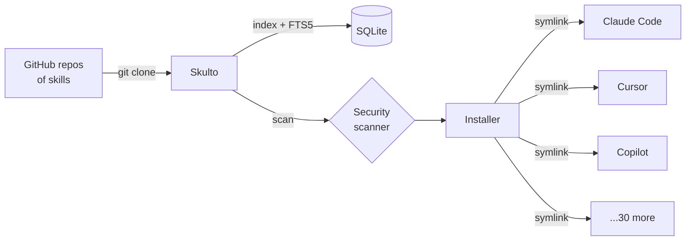
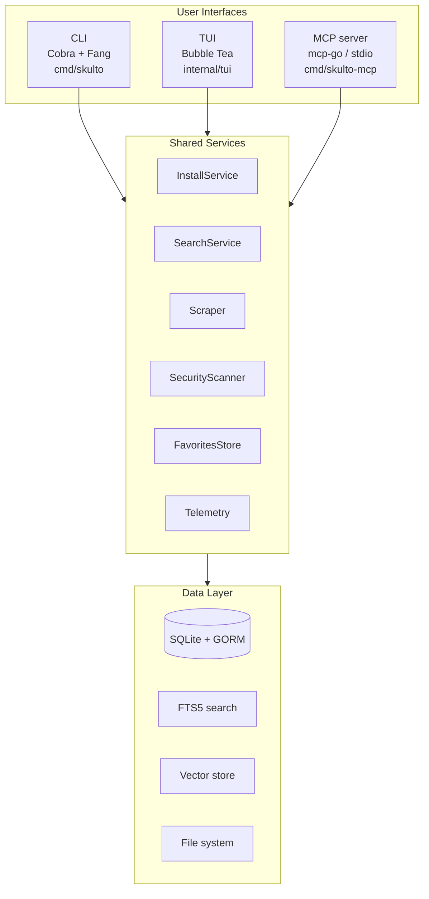

# What Skulto is

> **Skulto** scans AI agent *skills* for prompt injection **before** you install them — and manages those skills across **33** AI coding tools from one place.

A "skill" is a small Markdown file (typically `SKILL.md`, sometimes with scripts and reference files) that injects instructions, workflows, and context into an AI coding assistant. Skills are powerful and shareable — and that makes them an **attack surface**. A skill from a random GitHub repo can carry *prompt injection*: text engineered to override your agent's instructions, leak its context, or run dangerous commands.

Skulto exists to make installing skills **safe** and **uniform**. This guide is a seven-part course; this first part gives you the map and the single mental model that makes everything else click.

:::callout tip
Read the parts in order the first time — each assumes the one before it. After that, the sidebar is a reference: jump straight to CLI, TUI, MCP, Security, or Internals.
:::

## The two problems

**1 · Security.** Skills are untrusted input that flows straight into your agent's instructions. Skulto's scanner inspects skill content and assigns a threat level before (and as) you install.

**2 · Fragmentation.** Every AI tool stores skills somewhere different — Claude Code in one directory, Cursor in another, Copilot in a third — across 33 tools, each with global-vs-project scoping. Skulto installs to all of them from one command.



The one-line pitch in the README is the whole product in a sentence: *"Scan AI agent skills for prompt injection before you install them."*

## The one idea: three faces, one body

This is the most important thing to internalize. Skulto has **three user interfaces sitting on top of one shared service layer.** Whatever you can do in the CLI, you can do in the TUI and through the MCP server — because all three call the *same* services.



This is a real architectural decision in the repo — see `docs/adr/0003-three-interfaces-shared-services.md`. The MCP layer, for example, is a *thin adapter*: its handlers call the same `InstallService`, `Scraper`, and `db.DB` the TUI uses, with no business logic of its own.

**Why it matters to you:** features live in *services*; interfaces are thin. When you add a capability, you add it to a service and then surface it through whichever interfaces need it. When it's a genuinely new user-facing capability, that usually means all three.

:::reveal Before reading on — guess: if you wanted to add a "rescan all installed skills" capability, where would the *logic* live, and where would the *triggers* live?
The **logic** belongs in a service (the `SecurityScanner` plus a method on the scan/install path), not in any one interface. The **triggers** are thin: a `scan` subcommand in `internal/cli/`, a key/action in `internal/tui/`, and an MCP tool handler in `internal/mcp/` — each just calls the service. That separation is the heartbeat of working in this codebase.
:::

## Repository tour

You don't need to memorize this — just build a rough map.

```
skulto/
├── cmd/
│   ├── skulto/          # Main CLI/TUI binary entry point
│   └── skulto-mcp/      # MCP server binary (JSON-RPC 2.0 over stdio)
├── internal/
│   ├── cli/             # Cobra commands — one file per command (add.go, install.go, ...)
│   ├── tui/             # Bubble Tea TUI (views/, components/, design/)
│   ├── mcp/             # MCP server: tools + resources over the shared services
│   ├── installer/       # Cross-platform install via symlinks (the 33-platform registry)
│   ├── scraper/         # GitHub scraping via shallow git clones
│   ├── search/          # Hybrid search: FTS5 keyword + optional semantic
│   ├── security/        # Prompt-injection scanner (pattern packs + scoring)
│   ├── db/              # GORM + SQLite + FTS5 data layer
│   ├── models/          # Core structs: Skill, Tag, Source, SecurityResult, ...
│   ├── manifest/        # skulto.json project manifest (read/write)
│   ├── detect/          # Detect which AI tools are installed on the system
│   ├── discovery/       # Find unmanaged skills already in platform dirs
│   ├── favorites/       # File-based favorites (survives DB resets)
│   ├── telemetry/       # PostHog events (opt-out), defined in events.go
│   ├── config/          # Env-driven config + path resolution
│   └── ...              # migration, vector, embedding, llm, skillgen, log, testutil
├── pkg/version/         # Version info injected via ldflags at build time
├── context/             # Deep-dive technical docs (architecture, security, db, mcp, ...)
├── docs/                # Project docs (overview, getting-started, ADRs, glossary)
├── plans/               # Implementation plans (numbered + dated specs)
└── Makefile             # build / test / lint / ship entry points
```

The rule of thumb for "where do I change X":

| You want to change… | Look in… |
|---|---|
| A CLI command's behavior | `internal/cli/<command>.go` |
| A TUI screen | `internal/tui/views/` |
| What MCP exposes to agents | `internal/mcp/tools.go` + `handlers.go` |
| How skills get installed | `internal/installer/` |
| Threat detection | `internal/security/` |
| Repo cloning / parsing | `internal/scraper/` |
| Search behavior | `internal/search/` + `internal/db/` |
| Where data lives on disk | `internal/config/paths.go` |

:::callout note
Heads-up for when you read the repo's own docs: `context/mcp-server.md` and parts of
`context/security.md` carry illustrative snippets that have fallen behind the code (old
parameter names, an out-of-date view of the scanner's categories). When a doc and the code
disagree, the code wins — Part 5 and Part 6 point out the specific mismatches you'll hit.
:::

## Where to go next

- **Part 2 · Build & First Run** — clone, build both binaries, and watch the first-run experience.
- **Part 3 · The CLI** — the golden path and the full command reference.
- **Part 4 · The TUI** — the default front door most users actually see.
- **Part 5 · The MCP server** — wiring Skulto into an AI agent.
- **Part 6 · Security scanner** — how threat detection really works.
- **Part 7 · Data, search & contributing** — internals and how to ship a change.
