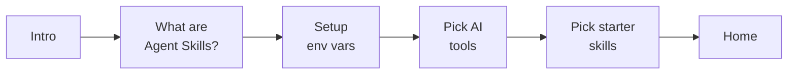

# Build & First Run

Skulto is **Go 1.25+** with a `Makefile` front door. This part gets you from a fresh clone to a running binary, and explains exactly what happens on first launch.

## Prerequisites

- **Go 1.25 or newer** (`go version` to check — the module declares `go 1.25.3`)
- **Make**
- Optional: `GITHUB_TOKEN` (higher GitHub API rate limits when scraping), `OPENAI_API_KEY` (enables semantic search)

## Clone and build

```bash
git clone https://github.com/asteroid-belt/skulto.git
cd skulto

make deps        # download modules, go mod tidy, install golangci-lint to ./bin/
make build-all   # build BOTH binaries into ./build/
```

You now have two binaries:

```bash
./build/skulto           # no subcommand → launches the interactive TUI
./build/skulto <cmd>     # run a CLI command (see Part 3)
./build/skulto-mcp       # run the MCP server (JSON-RPC over stdio; see Part 5)
```

The other build targets:

```bash
make build       # just the skulto CLI/TUI binary
make build-mcp   # just the MCP server
make dev         # development build WITH the race detector (needs CGO_ENABLED=1)
```

:::callout note
`make dev` and `make test-race` need `CGO_ENABLED=1` because the race detector requires cgo.
The normal build uses a **pure-Go SQLite driver** (`glebarez/sqlite`), so a plain
`make build` needs no C toolchain at all — that's deliberate, and it's why cross-compiling
in CI is painless.
:::

## What happens on first run

Run the bare binary:

```bash
./build/skulto
```

The root Cobra command's `RunE` is wired to `runTUI` (`internal/cli/cli.go:39`), so a bare
`skulto` launches the Bubble Tea TUI in the alternate screen. On a **fresh machine**, the
TUI checks persisted user state and routes you into a **five-step onboarding flow** instead
of the dashboard (`internal/tui/app.go:276-281`):



The decision is real and persistent: the TUI reads `GetUserState()` and, if
`IsOnboardingCompleted()` is false (status not `OnboardingFinished`), starts at
`ViewOnboardingIntro`. That status lives in the `user_state` table, so **once you finish
onboarding, every later launch opens straight to Home.** Press `enter` to advance through
the steps.

:::reveal Why does a bare `skulto` open a TUI instead of printing help like most CLIs?
Cobra calls a command's `RunE` when it's invoked with no matching subcommand. Skulto sets
the root's `RunE = runTUI`, so `skulto` → root `RunE` → `runTUI` → Bubble Tea app. Adding
`--help` or any subcommand short-circuits that path. It's a deliberate UX choice: the TUI
is the front door, the CLI is for scripting and power use.
:::

## Where Skulto keeps its data

Everything runtime lives under **`~/.agents/skulto/`** (resolved in
`internal/config/paths.go`). Knowing this directory is a debugging superpower.

| Path | Purpose |
|---|---|
| `~/.agents/skulto/skulto.db` | SQLite database (skills, sources, installations, user state) |
| `~/.agents/skulto/skulto.log` | Logfile (written via `log.Init(cfg.BaseDir)`) |
| `~/.agents/skulto/repositories/{owner}/{repo}/` | Cloned skill repos (shallow) |
| `~/.agents/skulto/favorites.json` | Favorites — a separate JSON store, survives DB resets |
| `~/.agents/skulto/skills/` | Your own local skills directory |
| `~/.agents/skulto/vectors/` | chromem-go vector store (only used when semantic search is on) |
| `~/.agents/skulto/embeddings.db` | Embeddings cache |

:::callout warning
The base dir is `~/.agents/skulto`, **not** `~/.skulto`. The latter is a legacy location
that Skulto actively migrates away from on startup (`internal/config/config.go`). If you're
poking at files by hand, use `~/.agents/skulto`.
:::

If search returns nothing, check the DB. If a clone looks stale, check `repositories/`. If
favorites survived a `Reset`, that's expected — they live in `favorites.json` precisely so
they outlive the database.

## Environment variables

None are required to start. The ones that matter (all read in `internal/config/config.go`):

| Variable | Effect |
|---|---|
| `GITHUB_TOKEN` | Higher GitHub API rate limits for scraping |
| `OPENAI_API_KEY` | Enables semantic (vector) search; also used for embeddings |
| `ANTHROPIC_API_KEY` / `OPENROUTER_API_KEY` | LLM provider keys for skill-gen features |
| `SKULTO_TELEMETRY_TRACKING_ENABLED=false` | Opt out of anonymous telemetry |
| `SKULTO_DEBUG` | Verbose debug logging |
| `SKULTO_SKIP_MIGRATION` | Skip the startup migration step |

## Sanity check

```bash
./build/skulto --version    # prints version + commit (injected via ldflags)
./build/skulto --help       # lists every subcommand (Part 3 covers them)
```

If both work, you're ready. **Part 3** walks the golden-path workflow through the CLI.
