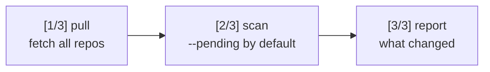

# The CLI

The CLI is Skulto's scripting surface — Cobra commands with Fang for polished help/version
output. Every subcommand is one file under `internal/cli/`. This part teaches the workflow
first, then gives you the full reference.

## The golden path

Here's the sequence a new user actually runs:

```bash
# 1. Add a repository of skills.
#    add clones it shallowly into ~/.agents/skulto/repositories AND
#    syncs + scans its skills immediately (unless you pass --no-sync).
./build/skulto add anthropics/skills          # alias: a

# 2. Find something to install.
./build/skulto list                            # configured source repos
./build/skulto info brainstorming              # detail on one skill

# 3. Install a skill to your AI tools (prompts for platforms + scope).
./build/skulto install brainstorming           # alias: i

# 4. See what's installed and where.
./build/skulto check                           # alias: ck
```

:::callout tip
A common misconception: that you must run `pull` and `scan` right after `add`. You don't —
**`add` already clones, syncs, and scans** in one shot (`internal/cli/add.go`). You'd run
`pull`/`scan` later only to *refresh* an existing repo or re-scan. The one-command refresh
for everything is `update`.
:::

### `update` — the safe refresh

```bash
./build/skulto update                          # alias: up
```

`update` does three phases in order (`internal/cli/update.go`): **[1/3]** pull all repos →
**[2/3]** security-scan (pending skills by default, or everything with `--scan-all`) →
**[3/3]** print a change report. Its help text describes it as `skulto pull` +
`skulto scan --pending`.



## Project skills: `save` and `sync`

Skulto has a project manifest, **`skulto.json`**, read from and written to the current
directory (`internal/manifest/manifest.go`). It's the lockfile-style mechanism for making a
project's skill set reproducible.

```bash
# Write your current project-scope installs into ./skulto.json
./build/skulto save

# On a teammate's machine: install exactly what skulto.json declares
./build/skulto sync
```

`save` records only project-scoped installs for the current dir (skipping local-only skills
that have no source repo). `sync` reads `skulto.json` and installs each listed skill; if
there's no manifest, it tells you to run `save` first. Running `install` with **no
arguments** routes to the same `sync` behavior.

:::reveal A teammate adds three skills to `skulto.json` and pushes. You pull the repo. One command installs exactly those — which?
`skulto sync`. It reads `skulto.json` from the working directory and installs the declared
skills. It's the counterpart to `save`, which writes your installed project skills *into*
`skulto.json`. Together they make a project's skill set reproducible.
:::

## `install` is flexible

`install` takes 0 or 1 argument (`cobra.RangeArgs(0, 1)`) and routes by what you pass:

| You run | What happens |
|---|---|
| `skulto install` | No arg → behaves like `sync` (installs from `skulto.json`) |
| `skulto install brainstorming` | A slug → installs that indexed skill |
| `skulto install owner/repo` | A URL/`owner/repo` → installs directly from that GitHub repo, with per-skill conflict resolution |

The URL detection (`isURL`) treats `http(s)://…` and any `owner/repo` (a `/` not starting
with `.`) as a repository.

## Full command reference

Every subcommand registered on the root (`internal/cli/cli.go`):

| Command (alias) | What it does |
|---|---|
| `add <repo-url>` (`a`) | Add a skill repository (clones + syncs + scans unless `--no-sync`) |
| `list` | **List all configured source repositories** |
| `pull` (`p`) | Pull and sync all skill repositories |
| `update` (`up`) | Pull repos, scan for threats, and report changes |
| `install [slug\|url]` (`i`) | Install skill(s) to AI tool directories |
| `uninstall <slug>` (`ui`) | Uninstall a skill from AI tool directories |
| `check` (`ck`) | Show installed skills and their locations |
| `scan` | Scan skills for security threats (`--all`, `--skill`, `--source`, `--pending`) |
| `info <slug>` | Show detailed information about a skill |
| `discover` | Discover unmanaged skills already in platform dirs |
| `ingest [name]` | Import a discovered skill into Skulto management |
| `save` | Save project skills to `skulto.json` |
| `sync` | Install skills from `skulto.json` |
| `remove [repo]` (`rm`) | Remove a skill repository |
| `favorites` | Manage favorites — subcommands `add` / `remove` / `list` |
| `feedback` | Show how to provide feedback |
| *(no args)* | Launch the interactive TUI (Part 4) |

:::callout note
**`list`** and the **`discover` → `ingest`** pair are the commands newcomers most often miss.
`discover` finds skills already sitting in your AI tools' directories that Skulto isn't
managing yet; `ingest` pulls one of those under Skulto management so it shows up in search,
scans, and `check`. That's how you adopt an existing setup instead of starting from scratch.
:::

## Telemetry & errors (worth knowing)

The root command tracks each subcommand's execution time and whether flags were used
(`PersistentPostRun` in `cli.go`), and CLI errors are classified into buckets
(`config_error`, `network_error`, `not_found_error`, …) via `trackCLIError`. All anonymous;
opt out with `SKULTO_TELEMETRY_TRACKING_ENABLED=false`. Part 7 covers the telemetry
contract you must follow when adding a command.

Next: **Part 4 · The TUI** — the same capabilities, but the interface most users live in.
