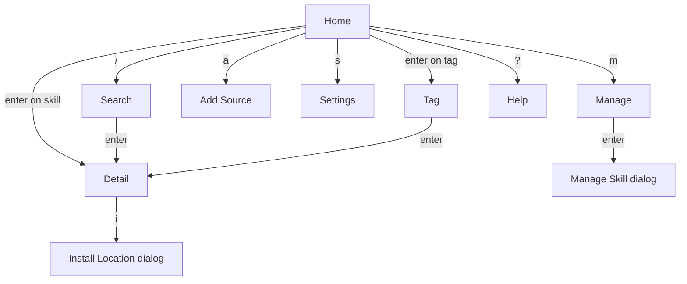
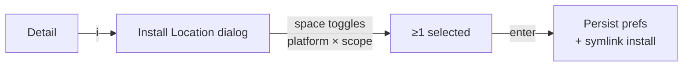

# The TUI

Run `skulto` with no arguments and you land here. It's a **Bubble Tea** application
(`internal/tui/`) running in the alternate screen with mouse support. Most users live in
the TUI, so if you're onboarding humans, this is the part that matters most.

:::callout warning
One trap for contributors: `internal/tui/keys.go` defines a keymap struct that is **largely
unused** for dispatch. The real keybindings come from per-view handlers that switch on the
pressed key directly. So `keys.go` says `Sync = s`, but on the Home screen `s` actually
opens **Settings** and `p` triggers pull. **Trust the per-view handlers, not `keys.go`.**
The keys in this part are taken from those handlers.
:::

## The views

The TUI is a state machine over a set of views (`ViewType` in `internal/tui/app.go`). On
first run you start in onboarding; afterward you start at **Home**.

| View | Purpose | Reach it via |
|---|---|---|
| **Home** | Dashboard: Installed Skills, Recently Viewed, Top Tags, animated skull header | Default landing |
| **Search** | Live hybrid search; under 3 chars shows a tag-browse grid | `/` from Home |
| **Detail** | Full skill markdown, metadata, install/favorite/scan actions | `enter` on a skill |
| **Tag** | All skills for one tag, with an in-tag filter | `enter` on a tag |
| **Manage** | Edit installed skills' locations + review "Discovered" skills | `m` from Home |
| **Settings** | Repos, AI tools, cache, security (mostly read-only) | `s` from Home |
| **Add Source** | Form to add a repo (`owner/repo`) | `a` from Home |
| **Reset** | Confirm + run a database reset | `ctrl+r` anywhere |
| **Help** | Overlay of global + current-view commands | `?` anywhere |

## Global keys

These work across the app (`internal/tui/app.go`):

| Key | Action |
|---|---|
| `?` | Open the Help overlay |
| `q` | Quit **with a confirmation dialog** (unless a text field is focused) |
| `ctrl+c` | Quit immediately (hard exit) |
| `ctrl+r` | Open the Reset view |

## Home

The dashboard is three columns you move *between* with left/right and *within* with up/down.

| Key | Action |
|---|---|
| `↑ ↓` / `k j` | Move within the current column |
| `← →` / `h l` | Switch column (Installed → Recently Viewed → Top Tags) |
| `enter` | Open the selected skill (Detail) or tag (Tag view) |
| `/` | Search · `m` Manage · `a` Add repo · `p` Pull · `s` Settings |
| `S` | Save project skills to `skulto.json` |
| `n` | New Skill dialog · `?` Help · `q` Quit |

The Home footer shows live progress bars for pull (`⚡`), security scan (`🔒`), and semantic
indexing, and the `m (manage (N))` label carries a **badge** counting discovered,
unmanaged skills waiting for review.

## Flow: search → detail → install

This is the flow you'll demo most.

**Search.** Press `/`. Type: under three characters you get a **tag-browse grid**; at three
or more you get **live hybrid results** (FTS5 keyword, plus semantic if a vector store is
configured — see Part 7), with name matches ranked above content matches. `tab` expands a
result's content snippet; `↑↓` navigate; `enter` opens Detail; `esc` returns Home.

**Detail.** Renders the skill's Markdown (via Glamour) with a metadata header. If the
skill's threat level isn't "none", a **security warning banner** appears at the top. Keys:

| Key | Action |
|---|---|
| `↑ ↓` / `k j`, `pgup/pgdn`, `home/end` | Scroll |
| `i` | Install / uninstall (opens the Install Location dialog) |
| `f` | Toggle favorite |
| `S` | Scan this skill for threats |
| `c` | Copy content to clipboard |
| `esc` | Back |

**Install Location dialog** (`internal/tui/components/install_location_dialog.go`). Pressing
`i` opens a multi-select of **Platform × Scope** checkboxes — each platform can be targeted
at **Global** (`~/…`) or **Project** (`./…`) scope independently.

| Key | Action |
|---|---|
| `↑↓` / `j k` / `tab` | Navigate options |
| `space` | Toggle the highlighted location |
| `a` / `n` | Select all / none |
| `g` / `p` | Global-only / project-only |
| `r` | Toggle "Remember these locations" |
| `enter` | Confirm (requires ≥1 selected) · `esc` cancel |

The dialog surfaces your **detected and previously-used platforms at the top**, and tucks
the rest behind a collapsible **"Other Agents (N)"** group (`▶`/`▼`). That "detected at top,
others collapsed, multi-select" behavior the README advertises is genuinely in the code.

:::reveal Where do the skills actually get placed, and why doesn't installing to five tools duplicate the file five times?
Installs are **symlinks** (Part 6 covers the installer). The skill lives once in Skulto's
storage; the dialog's selections become `InstallLocation` rows (platform + scope), and each
becomes a symlink into that tool's directory. Five tools = five links to one file, so an
update to the source propagates everywhere and nothing is duplicated.
:::

## Flow: manage & uninstall

Press `m` for **Manage**. It has two sections you switch with `tab`: **Installed** and
**Discovered**. `enter` on an installed skill opens the **Manage Skill dialog**, with
per-location checkboxes pre-checked to its current install state — toggle to add or remove
locations. If your changes include removals (and you haven't disabled the prompt), a
**Confirm Changes** dialog appears before anything is deleted. `enter` on a **Discovered**
skill imports it under Skulto management (the TUI equivalent of CLI `ingest`).

## Favorites & help

**Favorites** are a per-skill toggle (`f` in Detail), backed by `favorites.json` so they
survive a database reset — not a separate browsable screen. The **Help overlay** (`?`)
renders two tables: hardcoded global commands and the *current* view's command list; close
it with `esc`, `?`, or `q`.

## The look

The brand is a **skull**: block-letter `SKULTO` ASCII art (`internal/tui/design/skull.go`)
with the tagline "CROSS-PLATFORM AI SKILLS MANAGEMENT", in crimson `#DC143C` and gold
`#D4A84B`. The Home header animates and swaps to a minimal logo on narrow terminals.

Next: **Part 5 · The MCP server** — the same services again, this time for AI agents.
