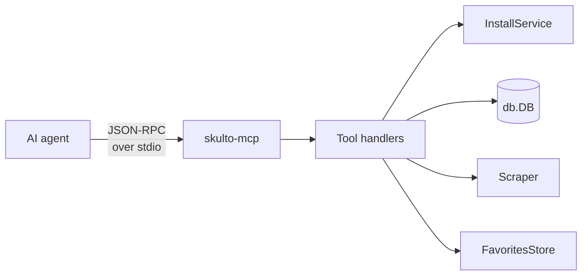
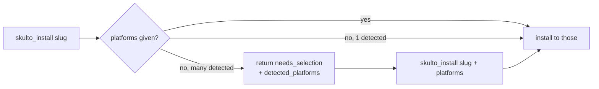

# The MCP Server

The third face. `skulto-mcp` (`cmd/skulto-mcp/main.go`) speaks the **Model Context
Protocol** over **stdio (JSON-RPC 2.0)**, letting an AI agent search, install, and manage
skills programmatically. It's built on [`mark3labs/mcp-go`](https://github.com/mark3labs/mcp-go)
and — true to the core mental model — it's a **thin adapter over the same services** the
CLI and TUI use.

## How it boots

```go
// cmd/skulto-mcp/main.go (shape)
cfg, _ := config.Load()
database, _ := db.New(db.DefaultConfig(paths.Database))
favStore := favorites.NewStore(paths.Favorites)
tc := telemetry.New(database)

server := mcp.NewServer(database, cfg, favStore, tc)
server.Serve(ctx)   // SyncInstallState, then ServeStdio
```

`NewServer` (`internal/mcp/server.go`) constructs the same `installer.New(...)`,
`installer.NewInstallService(...)`, scraper, and `db.DB` the TUI uses — the source comment
literally reads *"Same installer used by TUI"*. `Serve` first runs a best-effort
`SyncInstallState` (mirroring the TUI's startup) and then `ServeStdio`. There's no separate
business logic for MCP; handlers are adapters.



## Configure it in a client

Point your MCP client at the binary. Canonical example (from `context/mcp-server.md`, using
the Homebrew path):

```json
{
  "mcpServers": {
    "skulto": {
      "type": "stdio",
      "command": "/opt/homebrew/bin/skulto-mcp"
    }
  }
}
```

If `skulto-mcp` is on your `PATH`, `"command": "skulto-mcp"` is enough. Valid locations
include `~/.claude.json` (user-level) and a project-level `.mcp.json`. No arguments are
required beyond the binary name (the only flags are `--version` and `--help`).

:::callout tip
Building from source? Use the absolute path to your build:
`"command": "/Users/you/codes/skulto/build/skulto-mcp"`. The server shares the same
`~/.agents/skulto/` database as your CLI/TUI, so anything you `add` in one shows up in the
others.
:::

## The tool surface (12 tools)

All registered in `registerTools()` (`internal/mcp/server.go`); defined in `tools.go`,
handled in `handlers.go`.

| Tool | Purpose | Key params |
|---|---|---|
| `skulto_search` | Full-text search (BM25), most relevant first | `query` *(req)*, `limit` (≤100) |
| `skulto_get_skill` | Full skill detail incl. content; records a view | `slug` *(req)* |
| `skulto_list_skills` | List skills, paginated, newest-updated first | `limit`, `offset` |
| `skulto_browse_tags` | Tags for filtering, by category | `category` (language/framework/tool/concept/domain) |
| `skulto_get_stats` | DB stats: skills, tags, sources, installed count | — |
| `skulto_get_recent` | Recently viewed skills | `limit` (≤50) |
| `skulto_install` | Install a skill (symlink); auto-detects platforms | `slug` *(req)*, `platforms[]`, `scope` (default **project**) |
| `skulto_uninstall` | Remove a skill's symlink(s) | `slug` *(req)*, `platforms[]`, `scope` (default all) |
| `skulto_favorite` | Add/remove a favorite | `slug` *(req)*, `action` *(req: add/remove)* |
| `skulto_get_favorites` | List favorite skills | `limit` (≤100) |
| `skulto_check` | List installed skills with platforms + scopes | — |
| `skulto_add` | Add a repo and sync its skills (5-min timeout) | `url` *(req)* |

:::callout note
Two gotchas worth flagging:
**(1)** The binary's own `--help` text lists only 10 tools — it omits `skulto_check` and
`skulto_add`. The authoritative set is the **12** registered in `server.go`.
**(2)** `skulto_add`'s parameter is `url`. The `context/mcp-server.md` doc calls it
`repository` — that doc is stale. Trust `tools.go`.
:::

### The `skulto_install` selection handshake

`skulto_install` doesn't blindly install everywhere. If you omit `platforms` and **multiple**
platforms are auto-detected, the handler returns `needs_selection: true` with a
`detected_platforms` list and installs **nothing** — the agent is expected to re-call with a
chosen `platforms` array.



This mirrors the TUI's platform dialog: the human gets checkboxes, the agent gets a
two-step handshake. Same `InstallService` underneath.

:::reveal Default install scope differs between interfaces — what is it for MCP, and why might that surprise you?
The MCP `skulto_install` tool defaults `scope` to **project** (`./`). The underlying
`InstallService` default is **global** when no scope is supplied. So an agent that omits
`scope` installs into the *current project directory*, not your home dir. If you want global
installs from an agent, pass `"scope": "global"` explicitly.
:::

## Resources (2 templates)

Beyond tools, the server exposes two **resource templates** (`registerResources()` /
`resources.go`) — parameterized by skill slug:

| URI template | Returns | MIME |
|---|---|---|
| `skulto://skill/{slug}` | Full Markdown content of the skill | `text/markdown` |
| `skulto://skill/{slug}/metadata` | JSON metadata (tags, source, stats; no content) | `application/json` |

Resources are read-only references an agent can pull into context without a tool call.

## Telemetry

Every handler wraps itself in `trackToolCall(...)`, emitting the MCP-exclusive
`mcp_tool_called` event (`tool_name`, `duration_ms`, `success`) defined in
`internal/telemetry/events.go`. Handlers also emit shared events tagged with an `"mcp"`
source (e.g. `TrackSearchPerformed(query, n, "mcp")`), so the same action is comparable
across all three interfaces. Anonymous, opt-out as everywhere.

Next: **Part 6 · Security scanner** — the real threat model that justifies the whole tool.
