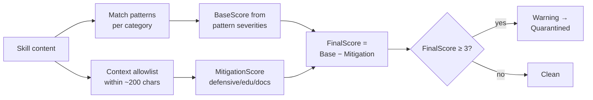
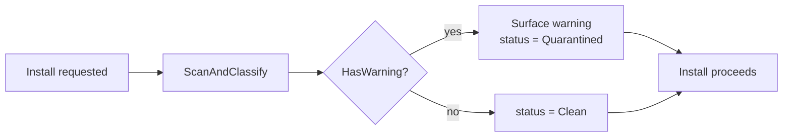

# Security Scanner

This is Skulto's reason to exist, so it's worth getting exactly right. The scanner lives in
`internal/security/`, and everything below describes what that code actually does.

:::callout warning
A natural assumption is that each category has a single severity. It doesn't — **severity
is assigned per *pattern*, not per category.** One category (e.g. dangerous scripts)
contains patterns ranging from MEDIUM all the way to CRITICAL. Keep the unit of severity in
mind: it's the individual pattern, not the bucket it sits in.
:::

## The nine categories

`ThreatCategory` constants (`internal/security/result.go`):

| Category | Catches |
|---|---|
| `instruction_override` | "ignore previous instructions", "disregard your rules" |
| `jailbreak` | DAN, "developer mode", "unrestricted AI" |
| `system_spoofing` | Fake system/role markers to impersonate the platform |
| `data_exfiltration` | Attempts to leak the system prompt or context |
| `obfuscation` | Encodings/tricks that hide intent from a reader |
| `agent_manipulation` | Steering the agent's behavior covertly |
| `privilege_escalation` | Gaining capabilities/permissions it shouldn't have |
| `multi_turn_erosion` | Slow boundary-wearing across turns |
| `script_danger` | Dangerous shell/Python/JS in scripts (reverse shells, `rm -rf`, eval) |

## Severity is per pattern

Each pattern (IDs like `IO-001`, `JB-004`, `DE-003`, `SH-008`, `PY-001`) carries its own
severity. The levels are `NONE, LOW, MEDIUM, HIGH, CRITICAL` (`internal/models/security.go`;
`LOW` is defined but currently unused by any pattern).

A few real examples so the spread is concrete:

- `instruction_override` patterns (`IO-001…005`) are uniformly **HIGH**.
- `jailbreak` is mostly **CRITICAL** (`JB-001…004`), but `JB-005` is **HIGH** — so "jailbreak = always critical" is imprecise.
- `data_exfiltration` is mixed: `DE-001/002` **HIGH**, `DE-003` **CRITICAL**, and script-side exfil patterns **MEDIUM**.
- `script_danger` spans **MEDIUM → CRITICAL**: a reverse shell (`SH-008`) or disk overwrite (`SH-003`) is CRITICAL; a `chmod` (`SH-002`) is MEDIUM; Python `eval/exec` (`PY-001`) is HIGH.

## Scoring: base minus context mitigation

The scanner doesn't just count hits. The `Scorer` computes:

```
FinalScore = BaseScore − MitigationScore
```

`BaseScore` comes from the matched patterns' severities. `MitigationScore` comes from a
`ContextAnalyzer` that looks for **allowlist** phrases within a ~200-character proximity
window of each match, weighted by context type:

| Context type | Weight | Example |
|---|---|---|
| defensive | 3 | "to defend against…", security tooling |
| educational | 2 | "understanding/learning about this threat", OWASP/CVE references |
| documentation | 1 | descriptive prose around the term |

So a security *tutorial* that quotes `"ignore previous instructions"` to *explain* the
attack gets its score reduced and isn't flagged as committing one. That nuance is exactly
what separates a useful scanner from a noisy one.



## Verdict: threshold and overall level

- A match counts toward the verdict only if its **FinalScore is positive** (it survived mitigation).
- The overall **threat level** is the highest severity among surviving matches.
- The binary warning fires when `FinalScore ≥ ThresholdWarning (3)` → `ConfidenceWarning` → `HasWarning = true`.
- `ScanAndClassify` then maps `HasWarning` → `SecurityStatusQuarantined`, otherwise `SecurityStatusClean`.

## What actually gets scanned

`ScanSkill` scans `skill.Content` — the **`SKILL.md` body, including its frontmatter, as one
string.** That's the always-on path.

Auxiliary files (scripts, references) are **not** automatically scanned by `ScanSkill`,
because their content isn't stored on the skill model — `scanAuxiliaryFile` returns empty.
Script/aux scanning happens only when a caller explicitly passes content to the separate
`ScanAuxiliaryContent(file, content)` method, which selects patterns by file type (shell vs
Python vs JS, gated on extension / `SKILL.md`).

:::callout note
Practical takeaway: today the strong guarantee is on `SKILL.md` content. Deep per-script
scanning exists in the engine but is opt-in at the call site. If you're hardening this,
that's the seam to wire up.
:::

## "Scan before install" — implemented, but non-blocking

The headline promise is real *and* has an asterisk. `InstallService.Install` calls
`security.NewScanner().ScanAndClassify(skill)` **before performing the install**
(`internal/installer/service.go:192-202`) — so every install is scanned. **But** the inline
comment says it plainly: *"informational — does not block."* A warning/quarantine result is
surfaced; it does **not** abort the install today.



:::reveal So is the README's "scan before you install" a lie?
No — but read it precisely. The scan genuinely runs *before* the symlink is created, so you
are *informed* before install. What's not yet wired is **blocking**: refusing to install a
high-threat skill. That's the gap the `plans/006-security-scan-before-install` work targets.
In one line: scanned at install and reported today; blocking is on the roadmap.
:::

## Using it directly

- **CLI:** `skulto scan` with `--all`, `--skill <slug>`, `--source <repo>`, or `--pending`. It runs the same `ScanAndClassify`.
- **TUI:** press `S` on a skill's Detail view; a banner shows on any non-clean skill.
- **MCP:** scanning is folded into the install path; there's no standalone scan tool.
- **Standalone:** `InstallService.ScanSkill(slug)` scans without installing.

Next: **Part 7 · Data, search & contributing** — the storage engine and how to land a change
that passes CI.
