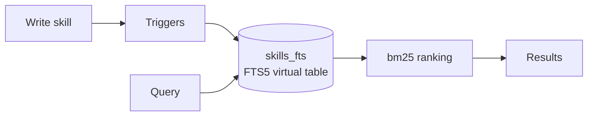
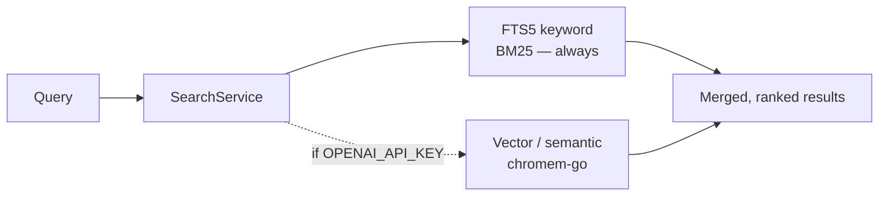
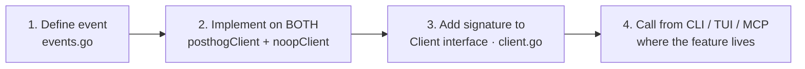
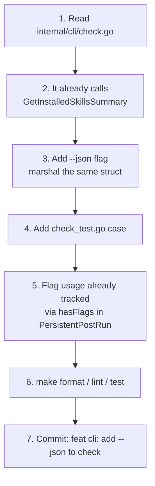

# Data, Search & Contributing

The last part: the storage engine, how search ranks, the telemetry contract you must honor,
and how to land a change that passes CI on the first try.

## Storage: SQLite + GORM + FTS5

Persistence is **SQLite via GORM**, using the **pure-Go** driver `glebarez/sqlite` (no cgo —
that's why cross-compiles are clean). Core models live in `internal/models/` (`Skill`,
`Tag`, `Source`, `SecurityResult`, `SkillInstallation`, `UserState`, …); data access is in
`internal/db/`.

Full-text search uses an **FTS5** virtual table, `skills_fts`, kept in sync with the skills
table via triggers (`internal/db/db.go` `setupFTS()`).



### BM25 ranking with column weights

FTS5 queries rank with **BM25** and explicit per-column weights
(`internal/db/skills.go`) — so a query hit in the title matters far more than one in the
body:

| Column | Weight |
|---|---|
| title | 10 |
| description | 5 |
| author | 2 |
| tags | 3 |
| content | 1 |

Queries `ORDER BY rank` where `rank = bm25(skills_fts, …)`.

## Hybrid search

`SearchService` (`internal/search/service.go`) runs **two** strategies and degrades
gracefully:

- **FTS5 keyword** — always available, fully offline. This is the baseline.
- **Semantic / vector** — *optional*. It's enabled only when a vector store exists, and the
  store is created only when an embedding API key is present.

The gating chain is worth memorizing:

```
OPENAI_API_KEY set
  → cfg.Embedding.APIKey != ""        (config.go)
  → vector store constructed          (tui.go)
  → HasVectorStore() == true
  → opts.IncludeSemantic && store != nil  (service.go)
```



:::reveal Offline on a plane with no API key — does search still work?
Yes. FTS5 keyword search runs entirely in local SQLite and is the always-on path. Semantic
ranking is the optional augmentation gated on `OPENAI_API_KEY`. Offline you lose semantic
re-ranking but keep full keyword search — that's the "offline-first" promise.
:::

## Telemetry: the four-step rule

Telemetry (`internal/telemetry/`) is anonymous PostHog, on by default, opt-out via
`SKULTO_TELEMETRY_TRACKING_ENABLED=false`. It's also gated on a `PostHogAPIKey` compiled in
via ldflags — so a dev build sends nothing regardless. As a contributor, the discipline that
reviewers and the compiler enforce: to add an event you touch **four** places.



Miss the `noopClient` half and telemetry-disabled builds won't satisfy the `Client`
interface — the most common slip. (`events.go` currently has 44 event methods mirrored
exactly across both clients.)

## Contributing without tripping a gate

The `Makefile` is your pre-flight check; CI (`.github/workflows/ci.yml`) runs the same
things on every push to `main` and every PR.

```bash
make format   # gofmt
make lint     # golangci-lint (5m timeout)
make test     # all tests + coverage → coverage.html
make ship_it  # build + lint + test, then push (the full pre-push gate)
```

CI runs three jobs: **lint**, **test** (with coverage), and a **build matrix** that
cross-compiles for linux/darwin on amd64/arm64. All three must be green to merge.

Tests are **co-located** with source as `*_test.go`, in three flavors:

- `foo_test.go` — ordinary unit tests next to `foo.go`
- `*_characterization_test.go` — snapshot-style tests that pin current behavior (great safety net for refactors)
- `*_integration_test.go` — broader tests that may touch the network

```bash
go test ./internal/cli/...        # one package
go test -v -run TestSearch ./...  # one test
```

Commits follow **Conventional Commits** with project scopes:

```
feat(scraper): add support for nested skill directories
fix(tui): correct keybinding conflict for search
test(db): add FTS5 ranking characterization tests
```

Types: `feat fix docs style refactor test chore perf` ·
Scopes: `cli tui mcp db installer scraper search security telemetry deps`.

:::callout note
The `AGENTS.md` "Finish the Task" checklist is the bar: linter clean, formatted, **new code
has tests**, all tests pass, **telemetry added for new user-facing features**, and relevant
docs (and `README.md`) updated.
:::

## A worked first change

Task: *"Add a `--json` flag to `skulto check` so scripts can parse installed skills."*



Notice you **didn't** touch the TUI or MCP — a CLI-only output flag is *presentation*. The
data already arrives shaped as `[]InstalledSkillSummary` from
`InstallService.GetInstalledSkillsSummary(ctx)`; you're adding a marshal branch, not new
logic. If the task were a new *capability* instead of a format, you'd surface it in all three
interfaces and add a telemetry event.

:::reveal What's the single judgment call that makes you fast in this codebase?
**Capability vs. presentation.** A new capability lives in a service and is surfaced through
CLI + TUI + MCP (plus telemetry + tests). A presentation change (an output format, a key
binding, a banner) is local to one interface. Recognizing which one you're doing — by
finding the service boundary first — tells you how wide the change is before you write a
line.
:::

## Where to go deeper

- `context/architecture.md` — component interactions and data flow
- `context/platforms.md` — the platform registry and detection
- `context/database.md` — schema, FTS5 setup, migrations
- `docs/adr/` — Architecture Decision Records (e.g. 0003, three-interfaces-shared-services)
- `plans/` — in-flight work (security-scan-before-install, data-loss-prevention, unified storage)

That's the whole map — overview, build, CLI, TUI, MCP, security, and internals. The fastest
way to cement it: run the golden path (`add → install → check`), then open the service
behind each step. The code is small, consistent, and now familiar.
