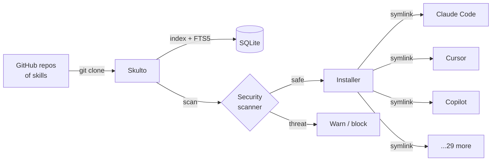
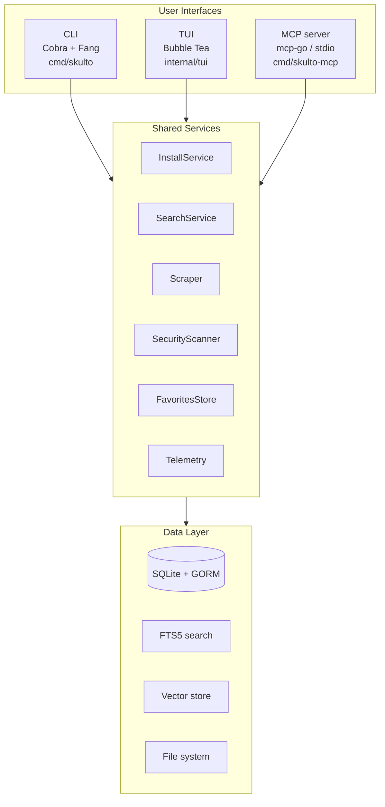
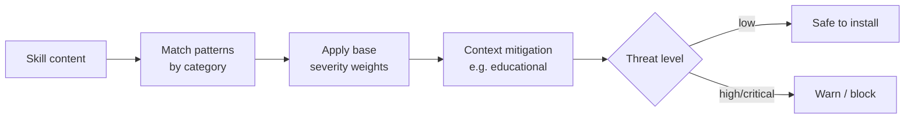
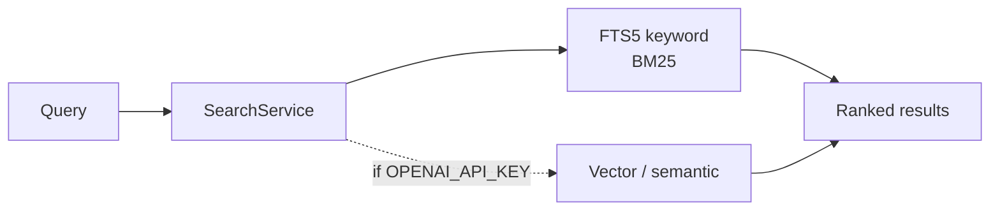
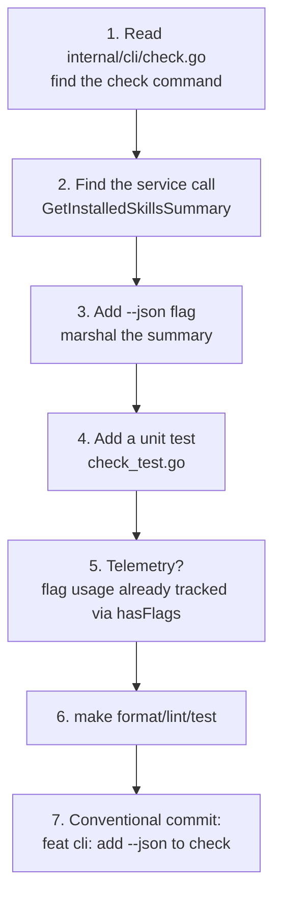

# Welcome to Skulto

> **Skulto** scans AI agent *skills* for prompt injection **before** you install them — and manages those skills across **33** AI coding tools from one place.

If you've ever copy-pasted a "skill" or rules file into Claude Code, Cursor, or Copilot and wondered *"what is this actually instructing my agent to do?"* — Skulto is the tool that answers that question, then installs the skill everywhere you want it.

This guide takes you from **never having seen the repo** to **confidently making your first change**. By the end you'll understand:

- The **problem** Skulto solves and the **mental model** behind it
- The **three interfaces** (CLI, TUI, MCP) and the **shared services** beneath them
- How to **build, run, and test** locally
- The **core workflows**: add a repo → scan → install → check
- The **security scanner**, the **database**, and the **installer** in enough depth to change them
- How to **contribute** without tripping a CI gate

:::callout tip
You don't need to read this top to bottom. The sidebar is your map — but the sections are ordered as prerequisites, so if a later section assumes something, it's because an earlier one covered it.
:::

## Why Skulto exists

AI coding assistants are increasingly driven by **skills** — small Markdown files (often `SKILL.md` plus scripts and references) that inject instructions, workflows, and context into an agent. They're powerful and shareable. They're also an **attack surface**: a skill you download from a random GitHub repo can contain *prompt injection* — text engineered to override your agent's instructions, exfiltrate your context, or run dangerous commands.

On top of the security problem, there's a **fragmentation** problem. Every tool stores skills differently: Claude Code wants them in one directory, Cursor in another, Copilot in a third — across 33 tools, with global-vs-project scoping for each.

Skulto solves both:



The one-line pitch lives in the README: *"Scan AI agent skills for prompt injection before you install them."* Everything in the codebase serves that sentence.

## The mental model: one codebase, three faces

The single most important idea in Skulto's architecture: **three user interfaces sit on top of one shared service layer.** Whatever you can do in the CLI, you can do in the TUI and through the MCP server — because they all call the same services.



**Why this matters for you as a contributor:** when you add a feature, you usually add it *to a service*, then expose it through all three interfaces. The `AGENTS.md` checklist even reminds you: a new user-facing feature means wiring telemetry and surfacing the capability in CLI, TUI, *and* MCP handlers. Features live in services; interfaces are thin.

:::reveal Before you read on — guess: if you wanted to add a "rescan all installed skills" feature, where would the *logic* live, and where would the *triggers* live?
The **logic** belongs in a service (likely `SecurityScanner` + a method on the install/scan path), not in any one interface. The **triggers** are thin: a `scan` subcommand in `internal/cli/`, a keybinding/view action in `internal/tui/`, and an MCP tool handler in `internal/mcp/`. Each just calls the service. This keeps the three faces consistent and is exactly the pattern the rest of the code follows.
:::

## Repository tour

Here's the lay of the land. You don't need to memorize it — just build a rough map so you know where to look.

```
skulto/
├── cmd/
│   ├── skulto/          # Main CLI/TUI binary entry point
│   └── skulto-mcp/      # MCP server binary (JSON-RPC 2.0 over stdio)
├── internal/
│   ├── cli/             # Cobra commands — one file per command (add.go, install.go, ...)
│   ├── tui/             # Bubble Tea TUI (views/, components/, design/)
│   ├── mcp/             # MCP server: tools + resources exposing the services
│   ├── installer/       # Cross-platform install via symlinks (the 33-platform registry)
│   ├── scraper/         # GitHub scraping via shallow git clones
│   ├── search/          # Hybrid search: FTS5 keyword + optional semantic
│   ├── security/        # Prompt-injection scanner (regex patterns + scoring)
│   ├── db/              # GORM + SQLite + FTS5 data layer
│   ├── models/          # Core structs: Skill, Tag, Source, Security, ...
│   ├── detect/          # Detect which AI tools are installed on the system
│   ├── discovery/       # Find unmanaged skills already in platform dirs
│   ├── favorites/       # File-based favorites (survives DB resets)
│   ├── telemetry/       # PostHog events (opt-out), defined in events.go
│   ├── llm/ embedding/  # Provider abstractions (Anthropic/OpenAI/OpenRouter)
│   └── ...              # config, migration, vector, skillgen, log, testutil
├── pkg/version/         # Version info injected via ldflags at build time
├── context/             # Deep-dive technical docs (architecture, security, db, ...)
├── docs/                # Project docs (overview, getting-started, ADRs, glossary)
├── plans/               # Implementation plans
└── Makefile             # build / test / lint / ship entry points
```

The rule of thumb encoded in `AGENTS.md`:

| You want to change… | Look in… |
|---|---|
| A CLI command's behavior | `internal/cli/<command>.go` |
| A TUI screen | `internal/tui/views/` |
| What MCP exposes to agents | `internal/mcp/` |
| How skills get installed | `internal/installer/` |
| Threat detection | `internal/security/` |
| Repo cloning / parsing | `internal/scraper/` |
| Search behavior | `internal/search/` + `internal/db/` |

## Get it building

Skulto is **Go 1.25+** with a `Makefile` front door. Clone, install deps, build.

```bash
git clone https://github.com/asteroid-belt/skulto.git
cd skulto

make deps        # downloads modules, go mod tidy, installs golangci-lint to ./bin/
make build-all   # builds both binaries into ./build/
```

You now have two binaries:

```bash
./build/skulto           # no subcommand → launches the interactive TUI
./build/skulto <cmd>     # run a CLI command
./build/skulto-mcp       # run the MCP server (speaks JSON-RPC over stdio)
```

Other build flavors:

```bash
make build       # just the skulto CLI/TUI binary
make build-mcp   # just the MCP server
make dev         # development build WITH the race detector (needs CGO_ENABLED=1)
```

:::callout note
**Optional environment variables.** None are required to start, but two unlock features:
`GITHUB_TOKEN` raises GitHub API rate limits for scraping, and `OPENAI_API_KEY` enables
semantic (vector) search embeddings. Telemetry is on by default and anonymous — set
`SKULTO_TELEMETRY_TRACKING_ENABLED=false` to opt out.
:::

### Where Skulto keeps its data

Everything runtime lives under `~/.agents/skulto/`:

| Path | Purpose |
|---|---|
| `~/.agents/skulto/skulto.db` | SQLite database (skills, sources, installations) |
| `~/.agents/skulto/skulto.log` | Logfile |
| `~/.agents/skulto/repositories/{owner}/{repo}/` | Cloned skill repos (shallow) |
| `~/.agents/skulto/favorites.json` | Favorites — persists across DB resets |
| `~/.agents/skulto/skills/` | Your own local skills directory |

Knowing this directory is a debugging superpower: if search returns nothing, check the DB; if a clone looks stale, check `repositories/`; if favorites vanished after a reset, they shouldn't have — they live in that JSON file precisely so they survive.

## Your first real workflow

Let's walk the **golden path** end to end using the CLI. This is the exact sequence a new user runs, and every step maps to a service you'll later read.

```bash
# 1. Add a repository of skills (clones it shallowly into ~/.agents/skulto/repositories)
./build/skulto add anthropics/skills          # alias: a

# 2. Pull / sync all configured repos so the DB index is fresh
./build/skulto pull                           # alias: p

# 3. Scan everything for prompt-injection threats
./build/skulto scan

# 4. Install a skill to your AI tools (it asks which platforms + scope)
./build/skulto install brainstorming          # alias: i

# 5. See what's installed and where
./build/skulto check                           # alias: ck
```

`update` (alias `up`) is the "do the safe thing" combo: it **pulls repos, scans for threats, and reports changes** in one shot — handy as a routine refresh.

Here's the full command surface so you can recognize each one:

| Command (alias) | What it does |
|---|---|
| `add <url>` (`a`) | Add a skill repository |
| `pull` (`p`) | Pull and sync all skill repositories |
| `update` (`up`) | Pull repos, scan for threats, and report changes |
| `install [slug\|url]` (`i`) | Install skill(s) to AI tool directories |
| `uninstall <slug>` (`ui`) | Uninstall a skill from AI tool directories |
| `check` (`ck`) | Show installed skills and their locations |
| `scan` | Scan skills for security threats |
| `discover` | Discover unmanaged skills already in platform dirs |
| `ingest [name]` | Import a discovered skill into Skulto management |
| `info <slug>` | Show detailed info about a skill |
| `favorites add/remove/list` | Manage favorite skills |
| `save` | Save project skills to `skulto.json` |
| `sync` | Install skills from `skulto.json` |
| `remove [repo]` (`rm`) | Remove a skill repository |
| *(no args)* | Launch the interactive TUI |

:::callout tip
`install` accepts a **URL** as well as a slug: `skulto install owner/repo` installs directly
from a GitHub repository, with per-skill conflict resolution when a repo has many skills.
:::

## The entry points, concretely

When you run `./build/skulto`, here's what actually happens (`cmd/skulto/main.go`):

```go
func main() {
    // 1. Context with signal handling
    ctx, cancel := context.WithCancel(context.Background())

    // 2. Load config, open the database
    cfg, _ := config.Load()
    paths := config.GetPaths(cfg)
    database, _ := db.New(db.DefaultConfig(paths.Database))

    // 3. Telemetry with a persistent (anonymous) tracking ID
    telemetryClient := telemetry.New(database)

    // 4. Execute CLI — launches the TUI if no subcommand is given
    cli.Execute(ctx, telemetryClient)
}
```

The root Cobra command (`internal/cli/cli.go`) registers every subcommand and uses
**Fang** for polished help/version output. Its `RunE` is `runTUI` — that's the trick that
makes a bare `skulto` open the TUI while `skulto install …` runs a command. A
`PersistentPostRun` hook tracks command execution time and `--help` usage as telemetry.

The MCP server (`cmd/skulto-mcp/main.go`) is structurally the same — load config + DB,
build the favorites store and telemetry, then `mcp.NewServer(...).Serve(ctx)` to speak
**JSON-RPC 2.0 over stdio**. Same services, different transport.

:::reveal Why does a bare `skulto` launch the TUI instead of printing help like most CLIs?
Because the root command's `RunE` is wired to `runTUI`. Cobra calls `RunE` when a command
is invoked with no matching subcommand. So `skulto` → root `RunE` → `runTUI` → Bubble Tea
app. Adding `--help` or any subcommand short-circuits that path. It's a deliberate UX
choice: the TUI is the "front door," the CLI is for scripting and power use.
:::

## The security scanner — Skulto's reason to exist

The scanner (`internal/security/`) inspects skill content — frontmatter, references, and
scripts — for prompt-injection and dangerous patterns, then assigns a **threat level**.

| Category | Severity | Example signals |
|---|---|---|
| Instruction Override | HIGH | "ignore previous instructions", "disregard rules" |
| Jailbreak | CRITICAL | DAN jailbreak, "developer mode", "unrestricted AI" |
| Data Exfiltration | HIGH | requests to leak the system prompt or context |
| Dangerous Commands | MEDIUM–HIGH | shell execution, destructive file operations |

Scoring isn't naive keyword counting. It uses **base severity weights with context
mitigation** — for example, content that's clearly *educational* (explaining what prompt
injection *is*) reduces the score, so a security tutorial doesn't get flagged as an attack.
That nuance is what separates a useful scanner from a noisy one.



The new path being built out (see `plans/006-security-scan-before-install`) makes the scan
gate the *install* step — "scan before install" — which is the literal promise on the tin.

## The installer — symlinks across 33 platforms

`InstallService` (`internal/installer/service.go`) is the unified install entry point for
all three interfaces. The actual mechanism is **symlinks**: a skill lives once in Skulto's
storage and is linked into each tool's directory, so updates propagate and there's no
duplication.

Its responsibilities:

- **Platform detection** — is the tool's command in `PATH`? does its directory exist?
- **Skill lookup** by slug in the database
- **Symlink creation/removal** at the right per-platform, per-scope paths
- **Recording** installs in the `skill_installations` table + telemetry

```go
type InstallService struct {
    installer *Installer      // low-level symlink operations
    db        *db.DB
    cfg       *config.Config
    telemetry telemetry.Client
}

func (s *InstallService) Install(ctx, slug string, opts InstallOptions) (*InstallResult, error)
func (s *InstallService) Uninstall(ctx, slug string, locations []InstallLocation) error
func (s *InstallService) GetInstallLocations(ctx, slug string) ([]InstallLocation, error)
func (s *InstallService) GetInstalledSkillsSummary(ctx) ([]InstalledSkillSummary, error)
```

The install flow: look up the skill → resolve target platforms (from options or saved
user preferences) → build the list of `InstallLocation` (platform × scope) → create
symlinks → record rows → emit telemetry. **Scope** matters: skills can go global (`~/`) or
per-project (`./`), independently per platform. The platform registry itself —
command name, project dir, global dir for each of the 33 tools — lives in
`internal/installer/platform.go`.

:::callout warning
Because installs are **symlinks**, deleting Skulto's stored copy breaks every link to it.
The `plans/003-installer-data-loss-prevention` work exists to guard exactly these
foot-guns. If you touch the installer, read that plan first.
:::

## The data layer — SQLite, GORM, and FTS5

Persistence is **SQLite via GORM**, with **FTS5** for full-text search (BM25 ranking,
~50ms latency). Models live in `internal/models/` (`Skill`, `Tag`, `Source`, `Security`,
…) and the data access lives in `internal/db/`.

Search is **hybrid** (`internal/search/`): FTS5 keyword search always works offline; if
`OPENAI_API_KEY` is set, semantic vector search (via `chromem-go` / the `vector` package)
augments it. This is why Skulto is "offline-first" — the core experience never needs the
network after the initial sync.



## Telemetry — the four-step rule

Telemetry (`internal/telemetry/`) is anonymous PostHog event tracking, on by default,
opt-out via `SKULTO_TELEMETRY_TRACKING_ENABLED=false`. The thing to *remember as a
contributor* is the discipline for adding an event, because CI and reviewers expect it:

1. **Define** the event in `internal/telemetry/events.go`
2. **Implement** the method on **both** `posthogClient` and `noopClient`
3. **Add** the signature to the `Client` interface in `client.go`
4. **Call** it from CLI, TUI, **and** MCP handlers where the feature lives

Miss the `noopClient` half and telemetry-disabled builds won't compile against the
interface — that's the most common slip.

## Contributing without tripping a gate

The `Makefile` is your pre-flight checklist. CI (`.github/workflows/ci.yml`) runs on every
push to `main` and every PR, and it runs the same things you can run locally:

```bash
make format   # gofmt
make lint     # golangci-lint (5m timeout)
make test     # all tests + coverage → coverage.html
make ship_it  # build + lint + test, then push (the full pre-push gate)
```

CI does three jobs: **lint**, **test** (with coverage), and a **build matrix**
cross-compiling for linux/darwin on amd64/arm64. All three must be green to merge.

Tests are **co-located** with source as `*_test.go`. You'll see three flavors:

- `foo_test.go` — ordinary unit tests next to `foo.go`
- `*_characterization_test.go` — snapshot-style tests that pin current behavior
- `*_integration_test.go` — broader tests that may touch the network

Commits follow **Conventional Commits** with project-specific scopes:

```
feat(scraper): add support for nested skill directories
fix(tui): correct keybinding conflict for search
test(db): add FTS5 ranking characterization tests
```

Types: `feat fix docs style refactor test chore perf`.
Scopes: `cli tui mcp db installer scraper search security telemetry deps`.

:::callout note
Before you call a task done, the `AGENTS.md` "Finish the Task" checklist applies: linter
clean, formatted, **new code has tests**, all tests pass, telemetry added for new
user-facing features, and relevant docs (and `README.md`) updated.
:::

## Putting it together — a contributor's first change

Imagine the task: *"Add a `--json` flag to `skulto check` so scripts can parse installed
skills."* Trace the path you'd now take:



Notice you **didn't** need to touch the TUI or MCP for a CLI-only output flag — but if the
task were a new *capability* rather than an output format, you'd surface it in all three
interfaces. That judgment call — *capability vs. presentation* — is the heartbeat of
working in this codebase.

:::reveal Final check: where does the *list of installed skills* actually come from, and why does that mean `--json` is a small change?
It comes from `InstallService.GetInstalledSkillsSummary(ctx)`, which already returns
structured `[]InstalledSkillSummary`. The CLI command currently formats that for humans;
adding `--json` just means marshaling the same struct instead of pretty-printing it. The
data is already shaped — you're adding a *presentation* branch, not new logic. That's why
recognizing the service boundary makes you fast here.
:::

## Where to go next

You now have the whole map. To go deeper, the repo's own docs are excellent:

- **`context/architecture.md`** — detailed component interactions and data flow
- **`context/platforms.md`** — the platform registry and detection logic
- **`context/security.md`** — scanner patterns, scoring, threat levels
- **`context/database.md`** — schema, FTS5 setup, GORM models, migrations
- **`context/mcp-server.md`** — MCP tools, resources, and handlers
- **`context/telemetry.md`** — the full event catalog
- **`docs/getting-started.md`** and **`docs/development.md`** — first-run and dev workflow
- **`plans/`** — in-flight work (security-scan-before-install, data-loss-prevention, unified skill storage)

Welcome aboard. The fastest way to internalize all of this: run the golden path
(`add → pull → scan → install → check`) against a real skills repo, then open the file
behind each step. The code is small, consistent, and — now — familiar.
